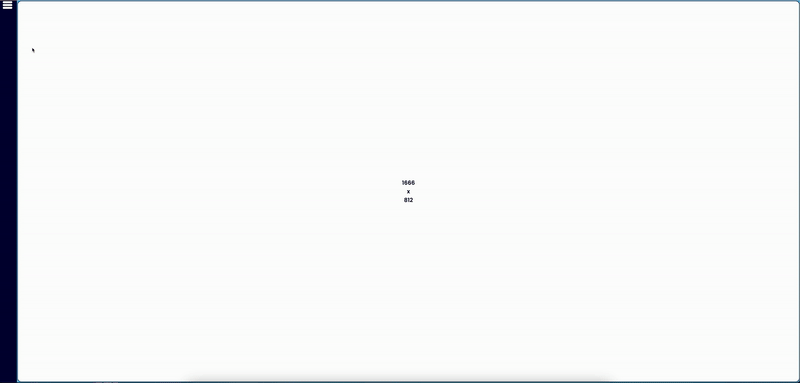
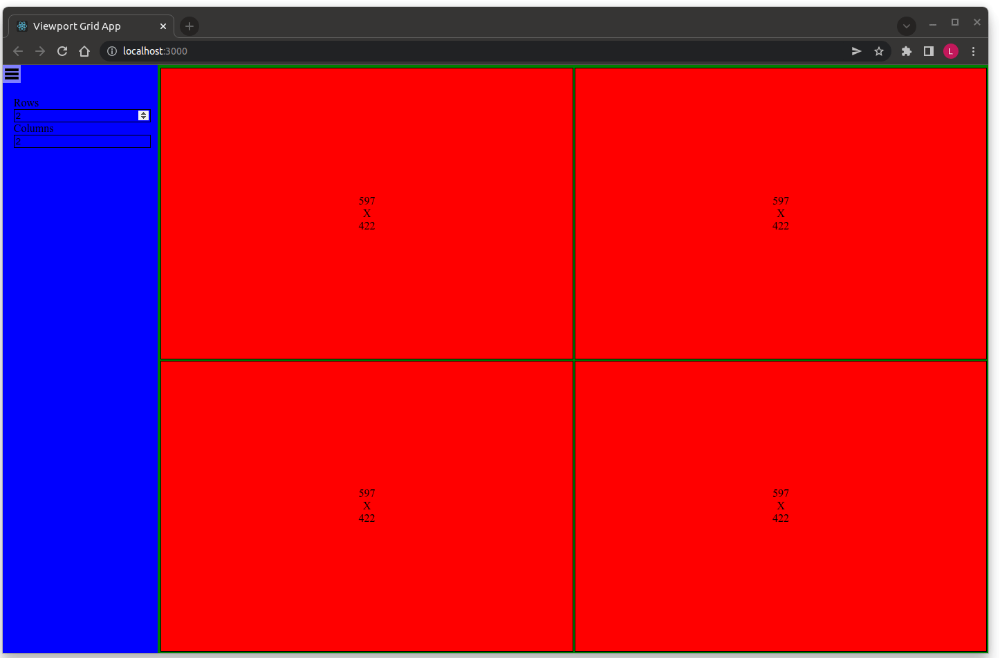

# Viewport Grid

## Overview

This is a single page application that contains a uniform Grid of viewports (GridArea), with a fixed Sidebar that expands when the Burger button is clicked. 
The Sidebar contains "Rows" and "Columns" ranges that define the number of "Rows" and "Columns", with a viewports at each position. The Grid adapts to browser resizes and Sidebar collapsing/expanding.
This project was created as part of a frontend challenge for Motilient. 

## Features
- Uniform grid layout
- Dynamic approach to different screen sizes
- Responsive design

### Demo

## Requirements

- nodejs >=14.19.1

## Project Setup
To set up this project as a developer, first ensure you are running the latest version of node.js.

1. Download and open the repository

`git clone https://github.com/veramferreira/frontend-challenge.git`

2. Run the following command to install the necessary package

 `npm install`

 3. Run `npm start` to start the app in the development mode
 4. Open [http://localhost:3000](http://localhost:3000) to view it in the browser\
The page will reload if you make edits

## Tech Stack:
This app uses the following technologies:
- Typescript
- SCSS
- React
- Jest
- Git (version control)

## Other considerations

This project was an exciting and challenging experience for me. I really enjoyed working on it and encountered several interesting aspects along the way. Here are some key points about the project:
- Implementing the dynamic grid to adapt to different viewports was a significant challenge. It required a lot of research and experimentation to get to the solution.
- Although time constraints limited the creation of a robust test suite, this project served as reminder of the importance of frontend testing. It inspired me to delve deeper into studying frontend TDD to enhance my testing skills.
- As TypeScript and SCSS were relatively new to me, I invested time in learning with these technologies to ensure the functionality of the app.
- I really enjoyed applying a modern and clean styling to the app.

Overall this project was very insightful and a great learning opportunity. I acquired new skills and knowledge while overcoming challenges, making it a rewarding experience.

## Original Task

Using the provided project template (based off create-react-app), create single page application that contains a uniform Grid of Viewports, with a fixed Sidebar. The Sidebar shall contain the inputs "Rows" and "Columns" both of which must be in the range of 1-10, and a button to collapse and expand the Sidebar. The Grid must show the defined number of "Rows" and "Columns", with a Viewport at each position. The Grid must fill remaining space and fit all Viewports equally, with a small gutter between them, and efficiently adapt to browser resizes and Sidebar collapsing/expanding. Each Viewport must have a thin border. Viewports must also be aware of their size at all times and be printed at its center. The example colours are just for reference and styling should be adjusted for a clean modern UX.

### Constraints

- Solution should be production quaility, documented, and reusable.
- Solution should contain appropriate unit testing.
- Solution should not require additional NPM packages.
- Solution should work against the latest version of Chrome, Firefox and Edge